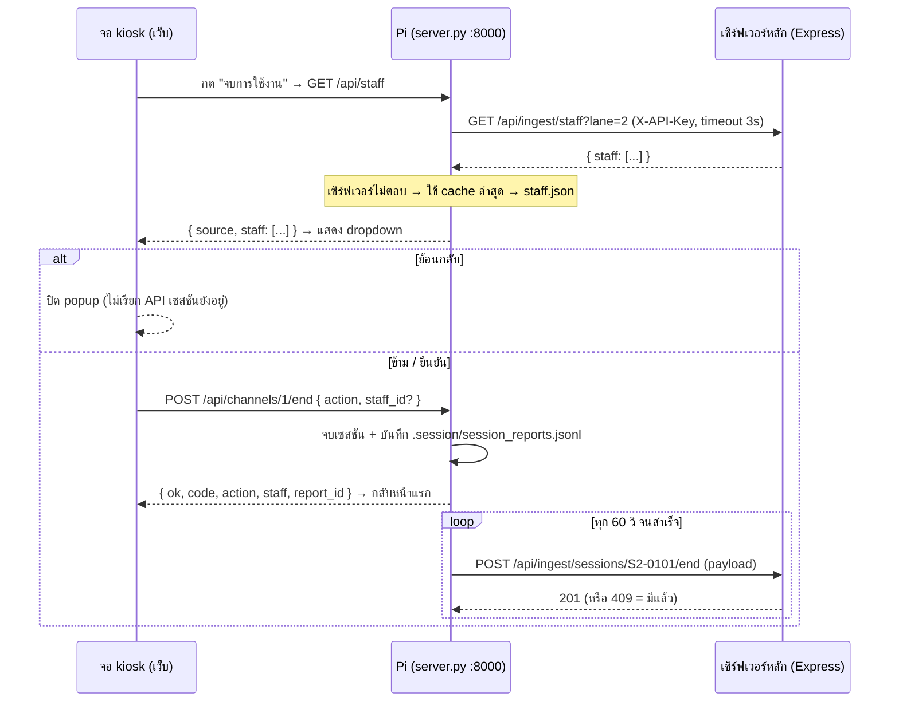

# จบการใช้งาน + ค่าคอมมิชชั่นผู้ดูแล — สเปก Database / API / Payload

เอกสารนี้อธิบายระบบ popup **"จบการใช้งาน"** ที่จอ kiosk ประจำเลน ซึ่งให้เลือก **ผู้ดูแล** ของเซสชันนั้น
เพื่อนำไปคิด **ค่าคอมมิชชั่น** บนเซิร์ฟเวอร์หลัก (shot24.shop)

| ส่วน | สถานะ |
|---|---|
| จอ kiosk (popup + dropdown + ปุ่ม ย้อนกลับ / ข้าม / ยืนยัน) | ✅ ทำแล้ว — `web/src/kiosk/components/EndSessionModal.jsx` |
| API บน Pi (`GET /api/staff`, `POST /api/channels/{ch}/end`) | ✅ ทำแล้ว — `local-pi/Gopro-connect/server.py`, `session_reports.py` |
| เก็บรายงานในเครื่อง + ส่งขึ้นเซิร์ฟเวอร์เบื้องหลัง | ✅ ทำแล้ว — ส่งซ้ำเองจนเซิร์ฟเวอร์รับ |
| **เซิร์ฟเวอร์หลัก: ตาราง, ingest API, admin API, หน้าเว็บ** | ⬜ **ยังไม่ทำ — ทำตามหัวข้อ 3–5 ของเอกสารนี้** |

---

## สารบัญ

1. [ภาพรวมการทำงาน](#1-ภาพรวมการทำงาน)
2. [API บน Pi (ทำแล้ว)](#2-api-บน-pi-ทำแล้ว)
3. [Database บนเซิร์ฟเวอร์หลัก](#3-database-บนเซิร์ฟเวอร์หลัก)
4. [Ingest API: Pi → เซิร์ฟเวอร์ (ต้องทำ)](#4-ingest-api-pi--เซิร์ฟเวอร์-ต้องทำ)
5. [Admin API: สำหรับหน้าเว็บจัดการ (ต้องทำ)](#5-admin-api-สำหรับหน้าเว็บจัดการ-ต้องทำ)
6. [วิธีคิดค่าคอมมิชชั่น](#6-วิธีคิดค่าคอมมิชชั่น)
7. [ทดสอบด้วย curl](#7-ทดสอบด้วย-curl)
8. [Checklist ฝั่งเซิร์ฟเวอร์](#8-checklist-ฝั่งเซิร์ฟเวอร์)

---

## 1. ภาพรวมการทำงาน



หลักการสำคัญ

- **ข้อมูลไม่หาย** — Pi บันทึกรายงานลงไฟล์ในเครื่องก่อนเสมอ เน็ตล่มหรือเซิร์ฟเวอร์ยังไม่มี API ก็ส่งให้เองทีหลัง
- **ส่งซ้ำได้ปลอดภัย** — ทุกรายงานมี `report_id` (UUID) เซิร์ฟเวอร์ต้องกันซ้ำด้วยค่านี้
- **ไม่กระทบระบบอัดคลิป** — คิวส่งรายงานแยกจากคิวอัปโหลดคลิป
- **1 เซสชันจบได้ครั้งเดียว** — หลังจบ Pi ล้างเซสชันทันที ลูกค้าคนต่อไปได้เลขเซสชันใหม่
- **ไม่ส่ง PIN ของลูกค้า** ในรายงานนี้

ความหมายของ 3 ปุ่มใน popup

| ปุ่ม | ผลลัพธ์ | เรียก API |
|---|---|---|
| **ย้อนกลับ** | ปิด popup กลับไปทำรายการต่อ เซสชันยังไม่จบ | ไม่เรียก |
| **ข้าม** | จบเซสชัน **ไม่ระบุผู้ดูแล** (ไม่มีค่าคอมมิชชั่น) แล้วส่งรายงาน | `POST /end` `{ "action": "skip" }` |
| **ยืนยัน** | จบเซสชัน + ระบุผู้ดูแลที่เลือก แล้วส่งรายงาน (กดได้เมื่อเลือกผู้ดูแลแล้ว) | `POST /end` `{ "action": "confirm", "staff_id": "7" }` |

---

## 2. API บน Pi (ทำแล้ว)

Base URL: `http://<pi>:8000` (เช่น `http://7lnetwork-s2:8000`) — ไม่มีการยืนยันตัวตน (อยู่ใน LAN)

### 2.1 `GET /api/staff` — รายชื่อผู้ดูแลสำหรับ dropdown

ลำดับแหล่งข้อมูล: **เซิร์ฟเวอร์หลัก** → **cache ล่าสุดในเครื่อง** (`.session/staff_cache.json`) → **`staff.json`** → ไม่มี

**Response 200**

```json
{
  "source": "cloud",
  "staff": [
    { "id": "7", "name": "สมชาย ใจดี" },
    { "id": "9", "name": "สมหญิง รักงาน" }
  ]
}
```

| field | type | คำอธิบาย |
|---|---|---|
| `source` | `"cloud"` \| `"cache"` \| `"local"` \| `"none"` | รายชื่อมาจากไหน (`none` = ไม่มีรายชื่อเลย → popup ให้กดได้แค่ ข้าม) |
| `staff[].id` | string | รหัสผู้ดูแล (Pi แปลงเป็น string เสมอ แม้เซิร์ฟเวอร์ส่งเป็นตัวเลข) |
| `staff[].name` | string | ชื่อที่แสดงใน dropdown |

> Pi กรองคนที่ `"active": false` ออกให้แล้ว

### 2.2 `POST /api/channels/{ch}/end` — จบเซสชัน

`ch` = เลขช่องกล้องภายใน Pi (ปกติ `1`)

**Request body**

```json
{ "action": "confirm", "staff_id": "7" }
```

```json
{ "action": "skip" }
```

| field | type | required | คำอธิบาย |
|---|---|---|---|
| `action` | `"confirm"` \| `"skip"` | ไม่ (default `skip`) | `confirm` = ระบุผู้ดูแล, `skip` = ไม่ระบุ |
| `staff_id` | string | เมื่อ `action = confirm` | ต้องเป็น id ที่อยู่ในรายชื่อจาก `GET /api/staff` |

> ส่ง body ว่างหรือไม่ส่งเลย = `skip` (รองรับหน้าเว็บรุ่นเก่า)

**Response 200**

```json
{
  "ok": true,
  "code": "S2-0101",
  "action": "confirm",
  "staff": { "id": "7", "name": "สมชาย ใจดี" },
  "report_id": "8927b1b3-3a3c-4f02-ba71-0133c16e2c6d"
}
```

`code` / `report_id` เป็น `null` ได้ ถ้าช่องนี้ไม่มีเซสชันเปิดอยู่ (ไม่มีอะไรให้รายงาน)

**Errors** (รูปแบบ FastAPI: `{ "detail": "ข้อความ" }`)

| status | เมื่อไร |
|---|---|
| `400` | `action` ไม่ใช่ `confirm`/`skip` หรือ `staff_id` ไม่อยู่ในรายชื่อ — **เซสชันยังไม่ถูกจบ** |
| `404` | ไม่มีช่อง `ch` นี้ |
| `409` | ช่องกำลังเตรียม/อัด/ดาวน์โหลด — รอให้เสร็จก่อน (ปุ่มจบการใช้งานถูกซ่อนช่วงนี้อยู่แล้ว) |

คลิปที่ยังแปลงไฟล์อยู่เบื้องหลังตอนกดจบ **จะทำต่อจนเสร็จและอัปขึ้นเซิร์ฟเวอร์ตามปกติ**

### 2.3 ไฟล์และค่าตั้งบน Pi

| ไฟล์ | คำอธิบาย |
|---|---|
| `.session/session_reports.jsonl` | รายงานจบเซสชันทุกรายการ (1 บรรทัด = 1 JSON) + `synced`, `synced_at` |
| `.session/staff_cache.json` | รายชื่อล่าสุดที่ได้จากเซิร์ฟเวอร์ (ใช้ตอนเน็ตล่ม) |
| `staff.json` | รายชื่อสำรอง **ใช้ระหว่างที่เซิร์ฟเวอร์ยังไม่มี `GET /api/ingest/staff`** — คัดจาก `staff.example.json` |

ตัวอย่าง `staff.json`

```json
[
  { "id": "1", "name": "ผู้ดูแล 1" },
  { "id": "2", "name": "ผู้ดูแล 2" },
  { "id": "3", "name": "ลาออกแล้ว", "active": false }
]
```

> **สำคัญ:** ถ้าตอนนี้ใช้ `staff.json` แล้วภายหลังย้ายรายชื่อไปเซิร์ฟเวอร์ ให้ใช้ **id ชุดเดียวกัน** กับตาราง `staff`
> ไม่งั้นรายงานที่ส่งจาก `staff.json` จะหา `staff_id` ไม่เจอ (ดูหัวข้อ 4.2 ข้อ 4 — ยังเก็บชื่อไว้ให้แก้ทีหลังได้)

ค่าใน `.env` ของ Pi

| key | default | คำอธิบาย |
|---|---|---|
| `CLOUD_URL` | — | URL เซิร์ฟเวอร์หลัก (ใช้ร่วมกับการอัปคลิป) |
| `CLOUD_API_KEY` | — | ต้องตรงกับ `API_KEY` ใน `server/.env` |
| `CLOUD_UPLOAD` | `1` | `0` = ไม่ติดต่อเซิร์ฟเวอร์ (รายงานเก็บในเครื่องอย่างเดียว) |
| `STAFF_FILE` | `staff.json` | ไฟล์รายชื่อสำรอง |
| `SESSION_REPORT_SYNC` | `60` | ลองส่งรายงานที่ค้างทุกกี่วินาที |
| `LANE_ID` | `1` | เลขเลนจริงของ Pi (ส่งไปใน `lane` และ query `?lane=`) |

ดูรายงานที่ยังไม่ขึ้นเซิร์ฟเวอร์บน Pi

```bash
grep '"synced": false' ~/Desktop/Shooting_Range/v2/local-pi/Gopro-connect/.session/session_reports.jsonl
```

---

## 3. Database บนเซิร์ฟเวอร์หลัก

เพิ่มใน `TABLES` ของ `server/src/db.js` (MySQL/MariaDB, `utf8mb4`, **เวลาเก็บเป็น UTC** เหมือนตารางเดิม)

### 3.1 `staff` — รายชื่อผู้ดูแล + เรทค่าคอมมิชชั่น

```sql
CREATE TABLE IF NOT EXISTS staff (
  id                BIGINT AUTO_INCREMENT PRIMARY KEY,
  name              VARCHAR(100)  NOT NULL,                 -- ชื่อที่แสดงใน dropdown ที่เลน
  phone             VARCHAR(32),
  commission_type   VARCHAR(10)   NOT NULL DEFAULT 'fixed', -- fixed | percent
  commission_value  DECIMAL(10,2) NOT NULL DEFAULT 0,       -- fixed = บาทต่อเซสชัน, percent = % ของยอดขายเซสชัน
  lanes             JSON,                                   -- NULL = ทุกเลน, [1,2] = เฉพาะเลน 1 และ 2
  active            TINYINT(1)    NOT NULL DEFAULT 1,       -- 0 = ไม่แสดงใน dropdown (เก็บประวัติไว้)
  note              VARCHAR(255),
  created_at        DATETIME(3)   NOT NULL DEFAULT CURRENT_TIMESTAMP(3),
  updated_at        DATETIME(3)   NOT NULL DEFAULT CURRENT_TIMESTAMP(3) ON UPDATE CURRENT_TIMESTAMP(3),
  KEY idx_staff_active (active)
) ENGINE=InnoDB DEFAULT CHARSET=utf8mb4
```

- **ห้ามลบแถว** — ถ้าลาออกให้ตั้ง `active = 0` ประวัติค่าคอมเดิมจะยังผูกกับ id ได้
- MariaDB เก็บ `JSON` เป็น `LONGTEXT` — กรอง `lanes` ในโค้ด JS ง่ายกว่าใน SQL

### 3.2 `session_ends` — รายงานจบเซสชัน (ตารางถาวร ไม่ลบตามอายุไฟล์)

```sql
CREATE TABLE IF NOT EXISTS session_ends (
  id             BIGINT AUTO_INCREMENT PRIMARY KEY,
  report_id      CHAR(36)      NOT NULL,          -- UUID จาก Pi ใช้กันส่งซ้ำ
  session_code   VARCHAR(64)   NOT NULL,          -- เช่น S2-0101 (ผูกกับ payments.session_code)
  lane           INT,
  channel        INT,
  device         VARCHAR(64),                     -- hostname ของ Pi เช่น 7lnetwork-s2
  started_at     DATETIME(3),                     -- UTC (null ได้)
  ended_at       DATETIME(3)   NOT NULL,          -- UTC
  duration_s     INT,
  clip_count     INT           NOT NULL DEFAULT 0,
  action         VARCHAR(10)   NOT NULL,          -- confirm | skip
  staff_id       BIGINT,                          -- NULL = skip หรือหา id ไม่เจอ
  staff_name     VARCHAR(100),                    -- ชื่อ ณ เวลาจบ (snapshot)
  rate_type      VARCHAR(10),                     -- snapshot เรท ณ เวลาจบ: fixed | percent
  rate_value     DECIMAL(10,2),                   -- snapshot เรท ณ เวลาจบ
  staff_matched  TINYINT(1)    NOT NULL DEFAULT 0,-- 1 = staff_id ตรงกับตาราง staff
  raw            JSON,                            -- payload ดิบจาก Pi
  received_at    DATETIME(3)   NOT NULL DEFAULT CURRENT_TIMESTAMP(3),
  UNIQUE KEY uq_report (report_id),
  KEY idx_se_code (session_code),
  KEY idx_se_staff (staff_id, ended_at),
  KEY idx_se_ended (ended_at)
) ENGINE=InnoDB DEFAULT CHARSET=utf8mb4
```

ทำไมต้อง snapshot `staff_name`, `rate_type`, `rate_value`
: แก้ชื่อหรือเปลี่ยนเรทในตาราง `staff` ทีหลัง **ต้องไม่ย้อนไปเปลี่ยนค่าคอมของเซสชันที่จบไปแล้ว**

ความสัมพันธ์กับตารางเดิม

```
session_ends.session_code ──┬── payments.session_code   (ถาวร → ใช้คิดยอดขายต่อเซสชัน)
                            ├── sessions.code           (ชั่วคราว ลบตามอายุไฟล์ — อย่าใช้ FK)
                            └── events.session_code
session_ends.staff_id ─────── staff.id                  (ไม่ใส่ FK — staff ไม่ถูกลบอยู่แล้ว)
```

### 3.3 `commission_payouts` — ปิดยอดจ่ายค่าคอม (ทางเลือก แนะนำ)

```sql
CREATE TABLE IF NOT EXISTS commission_payouts (
  id            BIGINT AUTO_INCREMENT PRIMARY KEY,
  staff_id      BIGINT        NOT NULL,
  period_from   DATETIME(3)   NOT NULL,           -- UTC
  period_to     DATETIME(3)   NOT NULL,           -- UTC
  sessions      INT           NOT NULL,
  revenue       INT           NOT NULL,           -- บาท (ยอดขายรวมของเซสชันในงวด)
  amount        DECIMAL(12,2) NOT NULL,           -- ค่าคอมที่ต้องจ่าย
  status        VARCHAR(12)   NOT NULL DEFAULT 'pending', -- pending | paid | void
  detail        JSON,                             -- snapshot รายการ session_ends + ยอดขาย + เรท ที่ใช้คิด
  note          VARCHAR(255),
  created_at    DATETIME(3)   NOT NULL DEFAULT CURRENT_TIMESTAMP(3),
  paid_at       DATETIME(3),
  KEY idx_payout_staff (staff_id, period_from)
) ENGINE=InnoDB DEFAULT CHARSET=utf8mb4
```

### 3.4 events ที่ควรเพิ่ม (ใช้ `logEvent` เดิม)

| type | เมื่อไร | meta |
|---|---|---|
| `session.ended` | รับรายงานจาก Pi สำเร็จ | `{ report_id, action, staff_id, staff_name, clip_count, duration_s }` |
| `session.staff_changed` | แอดมินแก้ผู้ดูแลของเซสชัน | `{ session_end_id, from_staff_id, to_staff_id }` |
| `commission.payout_created` / `commission.payout_paid` | ปิดยอด / จ่ายแล้ว | `{ payout_id, staff_id, amount }` |

---

## 4. Ingest API: Pi → เซิร์ฟเวอร์ (ต้องทำ)

ไฟล์: `server/src/routes/ingest.js` — router นี้มี `requireApiKey` อยู่แล้ว (**header `X-API-Key`** ต้องตรงกับ `API_KEY`)

### 4.1 `GET /api/ingest/staff?lane={lane}`

Pi เรียกทุกครั้งที่เปิด popup (timeout 3 วินาที — ต้องตอบเร็ว)

**Query**

| param | type | คำอธิบาย |
|---|---|---|
| `lane` | int (ไม่บังคับ) | เลนของ Pi — คืนเฉพาะคนที่ `lanes` เป็น `NULL` หรือมีเลนนี้ |

**Response 200**

```json
{
  "staff": [
    { "id": 7, "name": "สมชาย ใจดี", "active": true },
    { "id": 9, "name": "สมหญิง รักงาน", "active": true }
  ]
}
```

- คืนเฉพาะ `active = 1` (ถ้าส่งคนที่ `active: false` มา Pi จะกรองทิ้งให้อีกชั้น)
- เรียงตามชื่อ (`ORDER BY name`)
- **ไม่ต้องส่งเรทค่าคอม** มาที่ Pi

**Errors:** `401` API key ผิด

ตัวอย่าง implementation

```js
ingest.get('/staff', async (req, res, next) => {
  try {
    const lane = Number(req.query.lane) || null;
    const rows = await all('SELECT id, name, lanes FROM staff WHERE active = 1 ORDER BY name');
    const staff = rows
      .filter((s) => {
        const lanes = typeof s.lanes === 'string' ? JSON.parse(s.lanes) : s.lanes;
        return !lane || !Array.isArray(lanes) || lanes.includes(lane);
      })
      .map((s) => ({ id: s.id, name: s.name, active: true }));
    res.json({ staff });
  } catch (e) { next(e); }
});
```

### 4.2 `POST /api/ingest/sessions/:code/end`

Pi ส่งเมื่อจบเซสชัน (และส่งซ้ำทุก 60 วินาทีจนกว่าจะได้ `2xx` หรือ `409`)

**Headers**

```
X-API-Key: <API_KEY>
Content-Type: application/json
```

**Request body (สิ่งที่ Pi ส่งจริง)**

```json
{
  "report_id": "8927b1b3-3a3c-4f02-ba71-0133c16e2c6d",
  "session_code": "S2-0101",
  "lane": 2,
  "channel": 1,
  "device": "7lnetwork-s2",
  "started_at": "2026-09-15T00:52:13+07:00",
  "ended_at": "2026-09-15T01:05:40+07:00",
  "duration_s": 807,
  "clip_count": 2,
  "action": "confirm",
  "staff": { "id": "7", "name": "สมชาย ใจดี" }
}
```

ตัวอย่างกด "ข้าม"

```json
{
  "report_id": "cf691e69-215f-460c-a45a-7276c20bda3a",
  "session_code": "S2-0102",
  "lane": 2,
  "channel": 1,
  "device": "7lnetwork-s2",
  "started_at": "2026-09-15T01:10:02+07:00",
  "ended_at": "2026-09-15T01:18:44+07:00",
  "duration_s": 522,
  "clip_count": 1,
  "action": "skip",
  "staff": null
}
```

| field | type | null ได้ | คำอธิบาย |
|---|---|---|---|
| `report_id` | string (UUID v4) | ไม่ | **กันซ้ำ** — Pi อาจส่งรายงานเดิมหลายครั้ง |
| `session_code` | string | ไม่ | ต้องตรงกับ `:code` ใน URL |
| `lane` | int | ได้ | `LANE_ID` ของ Pi |
| `channel` | int | ไม่ | ช่องกล้องภายใน Pi |
| `device` | string | ไม่ | hostname ของ Pi |
| `started_at` | string ISO 8601 (+07:00) | ได้ | เวลาเริ่มเซสชัน (ลูกค้าเข้าเลน) |
| `ended_at` | string ISO 8601 (+07:00) | ไม่ | เวลากดจบ |
| `duration_s` | int | ได้ | วินาที |
| `clip_count` | int | ไม่ | คลิปที่อัดในเซสชันนี้ (รวมที่ยังแปลงไฟล์อยู่ตอนกดจบ) |
| `action` | `"confirm"` \| `"skip"` | ไม่ | |
| `staff` | `{ id: string, name: string }` | ได้ | `null` เมื่อ `action = "skip"` |

**ขั้นตอนที่เซิร์ฟเวอร์ต้องทำ**

1. ตรวจ `report_id`, `session_code`, `ended_at`, `action` — ขาดหรือผิดรูปแบบ → `400`
2. `session_code` ใน body ≠ `:code` → `400`
3. มี `report_id` นี้แล้ว → `409` (Pi ถือว่าสำเร็จ ไม่ส่งซ้ำอีก)
4. ถ้า `action = "confirm"`:
   - หา `staff.id` ในตาราง `staff` → เจอ: `staff_id = id`, `staff_matched = 1`, snapshot `staff_name` + `rate_type` + `rate_value` จากตาราง
   - ไม่เจอ (เช่นยังใช้ `staff.json` บน Pi): `staff_id = NULL`, `staff_matched = 0`, `staff_name = staff.name` จาก payload **ยังรับข้อมูลไว้** ให้แอดมินแก้ทีหลัง (หัวข้อ 5.3)
5. แปลง `started_at` / `ended_at` เป็น `Date` (UTC) ก่อน INSERT
6. INSERT `session_ends` (เก็บ payload ทั้งก้อนใน `raw`) + `logEvent('session.ended', ...)`
7. ไม่ต้องเช็กว่ามี `sessions.code` นี้หรือไม่ (ลูกค้าบางคนไม่ได้ตั้ง PIN / เซสชันอาจหมดอายุไปแล้ว)

**Responses**

| status | body | Pi ทำอะไร |
|---|---|---|
| `201` | `{ "ok": true, "id": 123, "staff_matched": true }` | บันทึกว่าส่งแล้ว |
| `409` | `{ "ok": true, "duplicate": true }` | บันทึกว่าส่งแล้ว |
| `400` | `{ "error": "ข้อความ" }` | **เก็บไว้และลองใหม่ทุก 60 วิ** — ใช้ 400 เฉพาะ payload เสียจริง แก้ฝั่งเซิร์ฟเวอร์แล้ว Pi จะส่งผ่านเอง |
| `401` | `{ "error": "API key ไม่ถูกต้อง" }` | ลองใหม่ (เช็ก `CLOUD_API_KEY` บน Pi) |
| `5xx` / timeout | — | ลองใหม่ |

ตัวอย่าง implementation

```js
const toDate = (s) => (s ? new Date(s) : null);

ingest.post('/sessions/:code/end', async (req, res, next) => {
  try {
    const b = req.body || {};
    if (!b.report_id || !b.ended_at || !['confirm', 'skip'].includes(b.action)) {
      return res.status(400).json({ error: 'ต้องมี report_id, ended_at และ action = confirm|skip' });
    }
    if (b.session_code !== req.params.code) {
      return res.status(400).json({ error: 'session_code ไม่ตรงกับ URL' });
    }
    if (await one('SELECT id FROM session_ends WHERE report_id = ?', [b.report_id])) {
      return res.status(409).json({ ok: true, duplicate: true });
    }

    let staff = null;
    if (b.action === 'confirm' && b.staff?.id != null) {
      staff = await one(
        'SELECT id, name, commission_type, commission_value FROM staff WHERE id = ?',
        [Number(b.staff.id)]
      );
    }

    const id = await insert(
      `INSERT INTO session_ends
         (report_id, session_code, lane, channel, device, started_at, ended_at, duration_s,
          clip_count, action, staff_id, staff_name, rate_type, rate_value, staff_matched, raw)
       VALUES (?,?,?,?,?,?,?,?,?,?,?,?,?,?,?,?)`,
      [b.report_id, b.session_code, b.lane ?? null, b.channel ?? null, b.device ?? null,
       toDate(b.started_at), toDate(b.ended_at), b.duration_s ?? null, b.clip_count ?? 0,
       b.action, staff?.id ?? null, staff?.name ?? b.staff?.name ?? null,
       staff?.commission_type ?? null, staff?.commission_value ?? null,
       staff ? 1 : 0, JSON.stringify(b)]
    );

    logEvent('session.ended', {
      session_code: b.session_code, lane: b.lane,
      meta: { report_id: b.report_id, action: b.action, staff_id: staff?.id ?? null,
              staff_name: staff?.name ?? b.staff?.name ?? null, clip_count: b.clip_count },
    });
    res.status(201).json({ ok: true, id, staff_matched: !!staff });
  } catch (e) {
    if (e.errno === 1062) return res.status(409).json({ ok: true, duplicate: true }); // ชนกันพร้อมกัน
    next(e);
  }
});
```

---

## 5. Admin API: สำหรับหน้าเว็บจัดการ (ต้องทำ)

ไฟล์: `server/src/routes/admin.js` — ใช้ **header `X-Admin-Key`** เหมือน endpoint admin เดิม
ช่วงเวลา (`from`, `to`) ใช้รูปแบบเดียวกับ `range(req)` เดิม (default 30 วันล่าสุด, คิดตามเวลาไทย)

### 5.1 จัดการรายชื่อผู้ดูแล

#### `GET /api/admin/staff`

```json
{
  "items": [
    {
      "id": 7, "name": "สมชาย ใจดี", "phone": "0812345678",
      "commission_type": "fixed", "commission_value": 50,
      "lanes": null, "active": true, "note": null,
      "created_at": "2026-09-15T02:00:00.000Z", "updated_at": "2026-09-15T02:00:00.000Z"
    }
  ]
}
```

Query ทางเลือก: `?active=1` (เฉพาะคนที่ใช้งาน)

#### `POST /api/admin/staff`

```json
{
  "name": "สมชาย ใจดี",
  "phone": "0812345678",
  "commission_type": "percent",
  "commission_value": 10,
  "lanes": [1, 2],
  "active": true,
  "note": "กะเช้า"
}
```

| field | type | required | validation |
|---|---|---|---|
| `name` | string | ✅ | 1–100 ตัวอักษร |
| `phone` | string | | ≤ 32 |
| `commission_type` | `"fixed"` \| `"percent"` | ✅ | |
| `commission_value` | number | ✅ | ≥ 0, `percent` ≤ 100 |
| `lanes` | int[] \| null | | null = ทุกเลน |
| `active` | boolean | | default `true` |
| `note` | string | | ≤ 255 |

Response `201` → `{ "ok": true, "id": 7 }` · `400` validation

#### `PATCH /api/admin/staff/:id`

ส่งเฉพาะ field ที่แก้ (field เดียวกับ POST) — Response `200` → `{ "ok": true }` · `404` ไม่พบ

> ไม่มี `DELETE` — ปิดการใช้งานด้วย `{ "active": false }`
> การเปลี่ยนเรท **มีผลเฉพาะเซสชันที่จบหลังจากนี้** (เซสชันเก่าใช้เรทที่ snapshot ไว้)

### 5.2 รายการเซสชันที่จบแล้ว

#### `GET /api/admin/session-ends`

| query | คำอธิบาย |
|---|---|
| `from`, `to` | ช่วงเวลา (กรองด้วย `ended_at`) |
| `lane` | กรองเลน |
| `staff_id` | กรองผู้ดูแล |
| `action` | `confirm` \| `skip` |
| `unmatched=1` | เฉพาะรายการที่หา `staff_id` ไม่เจอ (ต้องให้แอดมินแก้) |
| `limit`, `offset` | default 100, สูงสุด 1000 |

```json
{
  "total": 58,
  "items": [
    {
      "id": 123,
      "session_code": "S2-0101",
      "lane": 2,
      "started_at": "2026-09-14T17:52:13.000Z",
      "ended_at": "2026-09-14T18:05:40.000Z",
      "duration_s": 807,
      "clip_count": 2,
      "action": "confirm",
      "staff_id": 7,
      "staff_name": "สมชาย ใจดี",
      "staff_matched": true,
      "rate_type": "percent",
      "rate_value": 10,
      "revenue": 500,
      "commission": 50
    }
  ]
}
```

`revenue` = ยอดขายที่จ่ายแล้วของเซสชันนั้น, `commission` = ค่าคอมที่คำนวณ ณ ตอนเรียก (หัวข้อ 6)

### 5.3 แก้ผู้ดูแลของเซสชัน (กดผิด / ข้ามแล้วอยากเพิ่ม / id จาก staff.json ไม่ตรง)

#### `PATCH /api/admin/session-ends/:id`

```json
{ "staff_id": 9, "note": "ลูกค้าแจ้งว่าน้องสมหญิงดูแล" }
```

- `staff_id: null` = เอาผู้ดูแลออก (เปลี่ยนเป็นไม่มีค่าคอม)
- เซิร์ฟเวอร์ต้อง snapshot `staff_name`, `rate_type`, `rate_value` ใหม่จากตาราง `staff`, ตั้ง `action = 'confirm'` (หรือ `'skip'` เมื่อ null), `staff_matched = 1`
- ถ้าเซสชันนี้อยู่ใน `commission_payouts` ที่ `status = 'paid'` แล้ว → `409` ห้ามแก้
- `logEvent('session.staff_changed', ...)`

Response `200` → `{ "ok": true }` · `404` · `409`

### 5.4 สรุปค่าคอมมิชชั่น

#### `GET /api/admin/commissions?from=2026-09-01&to=2026-09-30&lane=2`

```json
{
  "period": { "from": "2026-08-31T17:00:00.000Z", "to": "2026-09-30T16:59:59.999Z", "timezone": "Asia/Bangkok" },
  "totals": {
    "sessions_ended": 140,
    "sessions_confirmed": 118,
    "sessions_skipped": 22,
    "unmatched": 3,
    "revenue": 42500,
    "commission": 3850
  },
  "items": [
    {
      "staff_id": 7,
      "staff_name": "สมชาย ใจดี",
      "sessions": 64,
      "clips": 121,
      "revenue": 23500,
      "commission": 2350,
      "paid_out": 1200,
      "outstanding": 1150
    }
  ]
}
```

- `paid_out` = ผลรวม `commission_payouts.amount` ที่ `status = 'paid'` ในช่วงนั้น, `outstanding` = `commission - paid_out`

### 5.5 ปิดยอด / จ่ายค่าคอม (ถ้าใช้ตาราง `commission_payouts`)

#### `POST /api/admin/commission-payouts`

```json
{ "staff_id": 7, "from": "2026-09-01", "to": "2026-09-15", "note": "งวดครึ่งเดือนแรก" }
```

เซิร์ฟเวอร์คำนวณยอด ณ ตอนนั้นแล้ว snapshot ลง `detail`:

```json
{
  "ok": true,
  "id": 15,
  "staff_id": 7,
  "sessions": 32,
  "revenue": 11800,
  "amount": 1180,
  "status": "pending"
}
```

#### `PATCH /api/admin/commission-payouts/:id`

```json
{ "status": "paid" }
```

`status`: `pending` → `paid` (ตั้ง `paid_at = NOW(3)`) หรือ `void` (ยกเลิก) · `GET /api/admin/commission-payouts?staff_id=&status=` สำหรับดูประวัติ

---

## 6. วิธีคิดค่าคอมมิชชั่น

### 6.1 สูตร (ต่อ 1 เซสชันที่ `action = 'confirm'`)

| `rate_type` | ค่าคอม |
|---|---|
| `fixed` | `rate_value` บาท ต่อเซสชัน |
| `percent` | `revenue × rate_value / 100` |

`revenue` = `SUM(payments.amount)` ที่ `payments.session_code = session_ends.session_code AND status = 'paid'`

`action = 'skip'` หรือ `staff_id IS NULL` → **ไม่มีค่าคอม**

### 6.2 เรื่องที่ต้องระวัง: ยอดขายเข้าทีหลังได้

ลูกค้า **ซื้อวิดีโอผ่านเว็บหลังจบเซสชันไปแล้ว** (ได้จนไฟล์หมดอายุ `RETENTION_DAYS`)
ถ้าคิดแบบ `percent` ยอดของเซสชันจะเพิ่มขึ้นได้อีกหลายวัน ดังนั้น

- **อย่าเก็บจำนวนเงินค่าคอมตอนรับรายงาน** — คำนวณสดตอนเรียก `GET /api/admin/commissions`
- **ปิดยอดหลังพ้นอายุไฟล์** (เช่น ปิดงวดของวันที่ 1–15 หลังวันที่ 15 + `RETENTION_DAYS`) แล้ว snapshot ลง `commission_payouts`

### 6.3 SQL สรุปต่อผู้ดูแล

```sql
SELECT se.staff_id,
       MAX(se.staff_name)                         AS staff_name,
       COUNT(*)                                   AS sessions,
       SUM(se.clip_count)                         AS clips,
       COALESCE(SUM(p.revenue), 0)                AS revenue,
       SUM(CASE se.rate_type
             WHEN 'fixed'   THEN se.rate_value
             WHEN 'percent' THEN COALESCE(p.revenue, 0) * se.rate_value / 100
             ELSE 0 END)                          AS commission
FROM session_ends se
LEFT JOIN (
  SELECT session_code, SUM(amount) AS revenue
  FROM payments
  WHERE status = 'paid'
  GROUP BY session_code
) p ON p.session_code = se.session_code
WHERE se.action = 'confirm'
  AND se.staff_id IS NOT NULL
  AND se.ended_at BETWEEN ? AND ?
  -- AND se.lane = ?
GROUP BY se.staff_id
ORDER BY commission DESC;
```

### 6.4 เรื่องที่ต้องตัดสินใจก่อนทำ

- เรทแบบ **fixed / percent / ผสม** (เช่น ฐาน 30 บาท + 5%)? — ถ้าผสมให้เพิ่ม `commission_base DECIMAL(10,2)` ในทั้ง `staff` และ snapshot ใน `session_ends`
- เซสชันที่ **ไม่มีคลิป** (`clip_count = 0`) หรือ **สั้นมาก** (เช่น `duration_s < 120`) ยังได้ค่าคอม fixed หรือไม่
- ผู้ดูแล **หลายคนต่อเซสชัน**? — ตอนนี้ Pi ส่งได้คนเดียว ถ้าต้องการหลายคนต้องแก้ทั้ง popup และตารางเป็น `session_end_staff (session_end_id, staff_id, share)`
- ปิดยอด **รายวัน / รายครึ่งเดือน / รายเดือน**

---

## 7. ทดสอบด้วย curl

ตั้งตัวแปรก่อน

```bash
export CLOUD=https://shot24.shop
export KEY=<API_KEY>
export ADMIN=<ADMIN_KEY>
```

เพิ่มผู้ดูแล

```bash
curl -s -X POST "$CLOUD/api/admin/staff" -H "X-Admin-Key: $ADMIN" -H "Content-Type: application/json" -d '{"name":"สมชาย ใจดี","commission_type":"fixed","commission_value":50}'
```

รายชื่อที่ Pi จะเห็น

```bash
curl -s "$CLOUD/api/ingest/staff?lane=2" -H "X-API-Key: $KEY"
```

จำลองรายงานจากจอ (รันซ้ำอีกครั้งต้องได้ 409)

```bash
curl -s -i -X POST "$CLOUD/api/ingest/sessions/S2-9999/end" -H "X-API-Key: $KEY" -H "Content-Type: application/json" -d '{"report_id":"00000000-0000-4000-8000-000000000001","session_code":"S2-9999","lane":2,"channel":1,"device":"test","started_at":"2026-09-15T10:00:00+07:00","ended_at":"2026-09-15T10:12:00+07:00","duration_s":720,"clip_count":1,"action":"confirm","staff":{"id":"1","name":"สมชาย ใจดี"}}'
```

สรุปค่าคอม

```bash
curl -s "$CLOUD/api/admin/commissions?from=2026-09-01&to=2026-09-30" -H "X-Admin-Key: $ADMIN"
```

ทดสอบฝั่ง Pi (ใน LAN)

```bash
curl -s http://7lnetwork-s2:8000/api/staff
```

---

## 8. Checklist ฝั่งเซิร์ฟเวอร์

- [ ] เพิ่มตาราง `staff`, `session_ends` (+ `commission_payouts` ถ้าใช้) ใน `server/src/db.js`
- [ ] `GET /api/ingest/staff` และ `POST /api/ingest/sessions/:code/end` ใน `server/src/routes/ingest.js`
- [ ] Admin API หัวข้อ 5 ใน `server/src/routes/admin.js`
- [ ] หน้าเว็บจัดการรายชื่อผู้ดูแล + รายงานค่าคอม (หน้าแอดมิน / `web/src/customer` / `server/public`)
- [ ] เพิ่มผู้ดูแลในตาราง `staff` โดยใช้ **id ชุดเดียวกับ `staff.json` บน Pi** (ถ้าเคยใช้ไปแล้ว) หรือแก้รายการ `unmatched` ผ่าน `PATCH /api/admin/session-ends/:id`
- [ ] Deploy แล้วดู log บน Pi: `journalctl -u gopro-kiosk -f | grep report` → ต้องเห็น `[report] ✅ ส่งรายงานจบเซสชัน ...`
- [ ] รายงานที่ค้างในไฟล์ `.session/session_reports.jsonl` บน Pi จะทยอยส่งขึ้นเองภายใน 60 วินาที ไม่ต้องทำอะไรเพิ่ม
